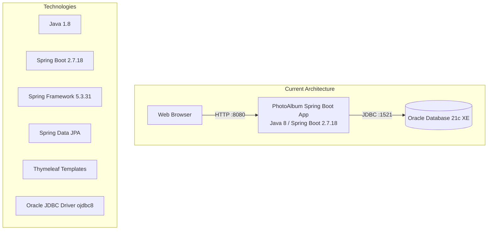
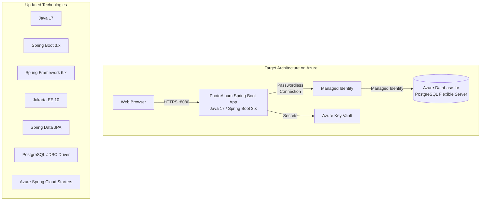

# Modernization Plan

**Branch**: `copilot/create-migration-plan` | **Date**: 2025-12-03

---

## Modernization Goal

Modernize the PhotoAlbum Java Spring Boot application to be Azure-ready by upgrading the application framework and migrating from Oracle Database to Azure Database for PostgreSQL. The goal is to ensure the application is running on supported versions of Java and Spring Boot while leveraging Azure's managed database services for improved scalability, security, and maintainability.

## Scope

Based on the AppCAT assessment results, the following modernization areas have been identified:

1. **Java Upgrade**
   - Java (1.8 → 17) [identified by assessment rule: azure-java-version-02000 - Legacy Java version]

2. **Spring Boot/Framework Upgrade**  
   - Spring Boot (2.7.18 → 3.x) [identified by assessment rule: spring-boot-to-azure-spring-boot-version-01000 - End of OSS Support]
   - Spring Framework (5.3.31 → 6.x) [identified by assessment rule: spring-framework-version-01000 - End of OSS Support]
   - *Note: Upgrading Spring Boot to 3.x automatically includes upgrading to Java 17, Spring Framework 6.x, and migrating from Java EE (javax.\*) to Jakarta EE (jakarta.\*)*

3. **Migration to Azure**
   - Migrate from Oracle Database to Azure Database for PostgreSQL [identified by assessment rule: azure-database-microsoft-oracle-07000 - Oracle database found]
   - Migrate plaintext credentials to Azure Key Vault [identified by assessment rule: azure-password-01000 - Password found in configuration file]

## Application Information

### Current Architecture

#### Application Details:
- **Application Name**: photo-album
- **Framework**: Spring Boot 2.7.18 with Spring MVC
- **Java Version**: 1.8 (Java 8)
- **Build Tool**: Maven
- **Database**: Oracle Database 21c Express Edition
- **Database Driver**: Oracle JDBC (ojdbc8)
- **Templating Engine**: Thymeleaf
- **Data Access**: Spring Data JPA with Hibernate
- **Photo Storage**: BLOBs stored in Oracle database

#### Identified Issues:
1. **Legacy Java Version** (Mandatory): Application uses Java 1.8 which has known security vulnerabilities
2. **Spring Boot End of OSS Support** (Mandatory): Spring Boot 2.7.18 is no longer supported
3. **Spring Framework End of OSS Support** (Mandatory): Spring Framework 5.3.31 is no longer supported
4. **Oracle Database** (Potential): Oracle requires migration to Azure-managed database services
5. **Plaintext Passwords** (Potential): Configuration files contain plaintext passwords - security risk

## Target Architecture

#### Target Configuration:
- **Java Version**: 17 (LTS)
- **Spring Boot Version**: 3.x (Latest stable)
- **Spring Framework**: 6.x
- **Database**: Azure Database for PostgreSQL Flexible Server
- **Authentication**: Managed Identity for passwordless connections
- **Secrets Management**: Azure Key Vault
- **Database Driver**: PostgreSQL JDBC

## Task Breakdown

> **NOTE**: This task list will be used by the `/appmod-kit.run-plan` command to execute the modernization.

### 1) Task name: Upgrade Spring Boot to 3.x
- **Task Type**: Java Upgrade
- **Description**: Upgrade the application from Spring Boot 2.7.18 to Spring Boot 3.x. This task includes:
  - Upgrading JDK from 1.8 to 17
  - Upgrading Spring Framework from 5.3.31 to 6.x
  - Migrating from Java EE (javax.\*) to Jakarta EE (jakarta.\*)
  - Updating all Spring Boot starter dependencies
- **Solution Id**: spring-boot-upgrade

### 2) Task name: Migrate from Oracle DB to Azure Database for PostgreSQL
- **Task Type**: Migration To Azure
- **Description**: Migrate the database layer from Oracle Database to Azure Database for PostgreSQL Flexible Server. This involves:
  - Replacing Oracle JDBC driver with PostgreSQL driver
  - Updating connection strings and database configuration
  - Converting Oracle-specific SQL and data types to PostgreSQL equivalents
  - Updating JPA/Hibernate dialect configuration
- **Solution Id**: oracle-to-postgresql

### 3) Task name: Migrate plaintext credentials to Azure Key Vault
- **Task Type**: Migration To Azure  
- **Description**: Migrate sensitive credentials from plaintext configuration files to Azure Key Vault for secure storage and access. This involves:
  - Integrating Azure Key Vault Spring Boot starter
  - Moving database credentials and other secrets to Key Vault
  - Configuring the application to retrieve secrets from Key Vault at runtime
- **Solution Id**: plaintext-credential-to-azure-keyvault

---

## Assessment Summary

| Category | Rule ID | Description | Severity | Files Affected |
|----------|---------|-------------|----------|----------------|
| Java Upgrade | azure-java-version-02000 | Legacy Java version (1.8) | Mandatory | pom.xml |
| Framework Upgrade | spring-boot-to-azure-spring-boot-version-01000 | Spring Boot 2.7.18 End of OSS Support | Mandatory | pom.xml |
| Framework Upgrade | spring-framework-version-01000 | Spring Framework 5.3.31 End of OSS Support | Mandatory | pom.xml |
| Database Migration | azure-database-microsoft-oracle-07000 | Oracle database found | Potential | pom.xml, application.properties, application-docker.properties, docker-compose.yml |
| Security | azure-password-01000 | Password found in configuration file | Potential | application.properties, application-docker.properties, application-test.properties |
| Configuration | spring-boot-to-azure-port-01000 | Server port configuration found | Potential | application.properties, application-docker.properties |
| Configuration | spring-boot-to-azure-restricted-config-01000 | Restricted configurations for Azure Container Apps | Potential | application.properties, application-docker.properties |

## Next Steps

1. Review this migration plan and confirm the scope
2. Execute the migration using `/appmod-kit.run-plan` command
3. Test the migrated application thoroughly
4. Deploy to Azure Container Apps or Azure App Service
